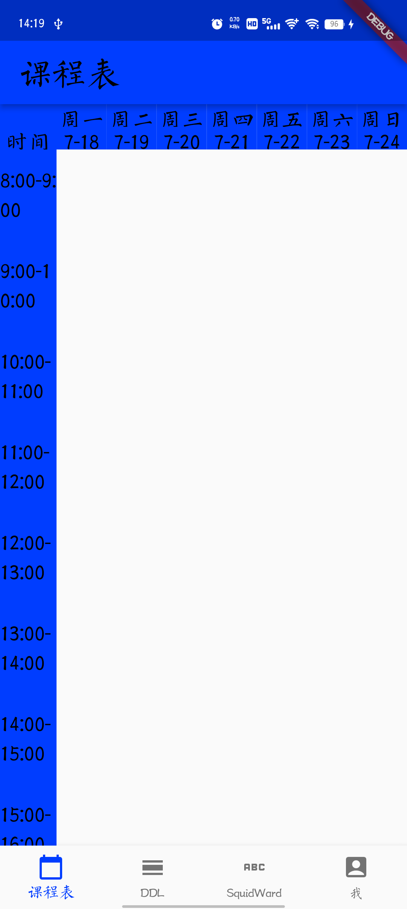

# 邮历

采用 `Flutter`开发的DDL管理软件。

### 特点

- 内置[二大班通知大全](http://squidward.top/?admin=false#/home/dddd)网站，支持网站中的DDL快捷添加
- 支持通过姓名和学号进行验证以查看小班班委们创建的DDL

## 使用

> 目前仍在前期的开发迭代阶段，只用 `pre-release`的版本供开发人员测试

- 课程表页面目前没有任何课程，相关的功能已经在快速开发中...
- DDL页面可以查看自己新建的DDL
- SquidWard页面可以显示在[二大班通知大全](http://squidward.top/?admin=false#/home/dddd)上的DDL和活动，并加入和自己相关的DDL
- “我”界面可以登录以查看所在小班的相关通知，管理自己创建的所有DDL

## 开发

采用 `Flutter`相关技术栈，参考[官方教程](https://flutter.cn/docs/get-started/install)配置需要的环境。
